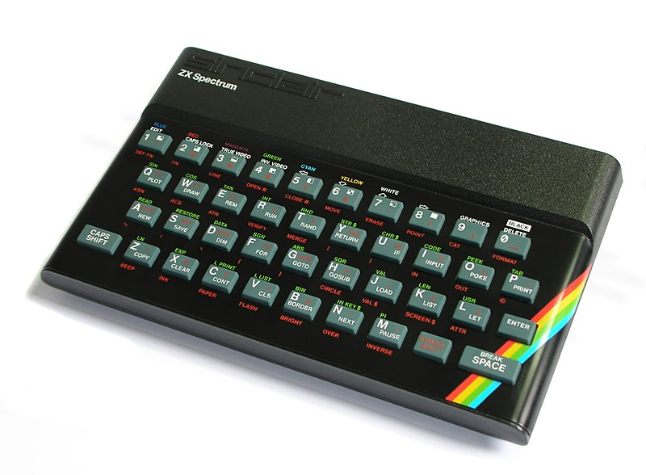
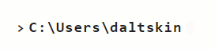

Hey!  I work as a Technical Program Manager within **Microsoft's Commercial Software Engineering organization**, helping customers and partners develop solutions based on the Microsoft Azure platform. I’m as old as I look, with over 20 years’ experience as a Microsoft software developer. I’m passionate about the Intelligent Cloud and creating new experiences using a range of Microsoft technologies. I have a degree from the university of life and once read some books (I also have a real degree).

My first ever 💻 computer was a Spectrum 48k (yep the rubber key version), where I learnt to copy lines of code out of a book to produce non-working games with endless frustration. Today, I still sometimes experience the same frustration coding, but at least the debug experience is much better :)

I build stuff mostly in C#, and occasionally work in other languages such as C, nodejs and python.

<!--
**daltskin/daltskin** is a ✨ _special_ ✨ repository because its `README.md` (this file) appears on your GitHub profile.

Here are some ideas to get you started:

- 🔭 I’m currently working on ...
- 🌱 I’m currently learning ...
- 👯 I’m looking to collaborate on ...
- 🤔 I’m looking for help with ...
- 💬 Ask me about ...
- 📫 How to reach me: ...
- 😄 Pronouns: ...
- ⚡ Fun fact: ...
-->
